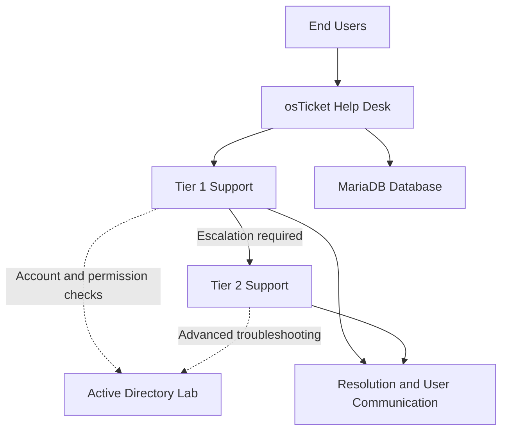
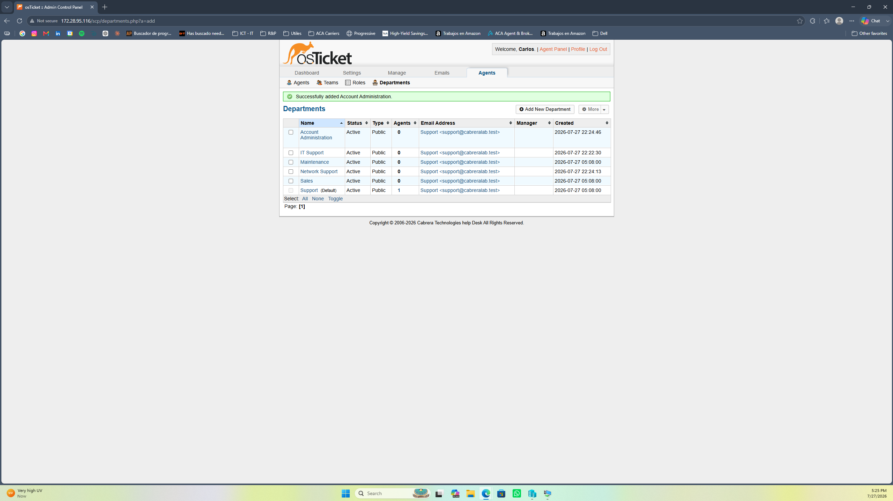
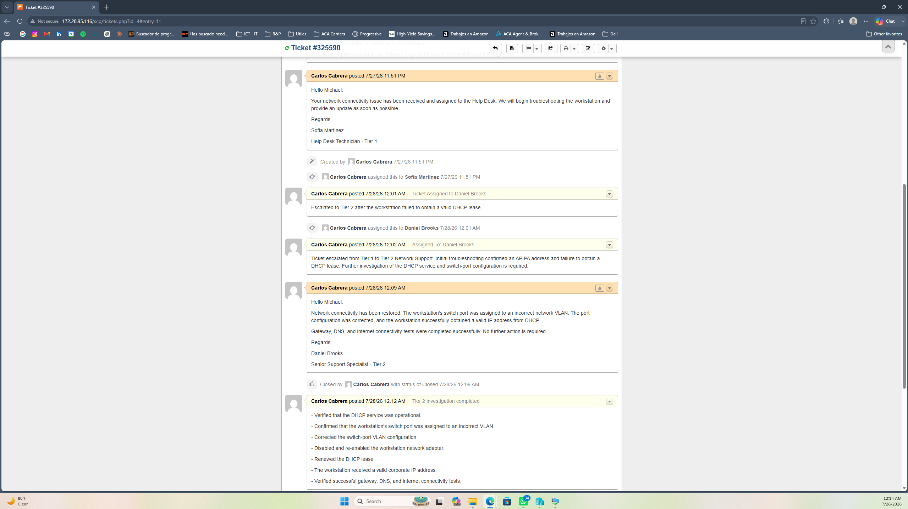
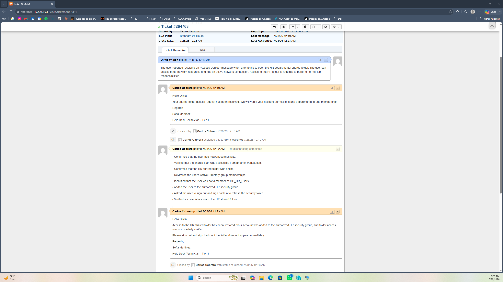
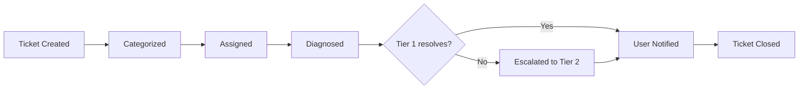

# Help Desk Ticketing Lab

## Project Overview

This project documents the design and implementation of a self-hosted Help Desk ticketing environment using osTicket on an Ubuntu Server virtual machine. The lab simulates a small enterprise support operation with departments, role-based access, service-level agreements, ticket routing, Tier 1 troubleshooting, Tier 2 escalation, user communication, and incident resolution.

The environment was created as a hands-on portfolio project for entry-level Help Desk, IT Support Specialist, and Desktop Support roles.

> This is an isolated home-lab environment. All users, agents, email addresses, incidents, and company information shown in this repository are fictional.

## Objectives

- Deploy a Linux-based ticketing server in Hyper-V.
- Install and secure the Apache, MariaDB, and PHP application stack.
- Deploy and configure osTicket.
- Implement departments, technical roles, agents, users, and SLA plans.
- Route requests through appropriate Help Topics.
- Document complete incident lifecycles.
- Demonstrate Tier 1 diagnosis and Tier 2 escalation.
- Connect ticket resolutions to Active Directory concepts.
- Practice clear technical documentation and user communication.

## Lab Architecture

| Component | Configuration |
|---|---|
| Hypervisor | Microsoft Hyper-V |
| Virtual machine | TICKET01 |
| Operating system | Ubuntu Server 22.04.5 LTS |
| Ticketing platform | osTicket v1.18.4 |
| Web server | Apache HTTP Server |
| Database | MariaDB |
| Application runtime | PHP 8.2 |
| Host system | Windows 11 Pro |

## Implementation

### 1. Server deployment

I created a Generation 2 Ubuntu Server virtual machine in Hyper-V with dynamic memory, two virtual processors, a virtual hard disk, Secure Boot configured for Linux, and network connectivity through a Hyper-V virtual switch.

After installing Ubuntu Server, I verified network connectivity and DNS resolution, updated the operating system, and enabled OpenSSH for remote administration.

### 2. Web application stack

I installed and configured:

- Apache
- MariaDB
- PHP 8.2
- PHP extensions required by osTicket
- GDlib and APCu

I verified the Apache and MariaDB services, tested the web server, created a dedicated database and database user, and confirmed that the required PHP extensions were enabled.

### 3. osTicket deployment and security

I downloaded osTicket from its official release repository, verified the package checksum, deployed the application files, and configured an Apache virtual host.

After completing the web installer, I:

- Removed the installation directory.
- Restricted access to the osTicket configuration file.
- Used a dedicated database account instead of the MariaDB root account.
- Avoided publishing passwords or other credentials.
- Verified access to the Staff Control Panel.

## Help Desk Configuration

### Departments

- Support
- IT Support
- Network Support
- Account Administration
- Maintenance
- Sales

### Support roles

| Role | Responsibility |
|---|---|
| Help Desk Technician - Tier 1 | Initial triage, common troubleshooting, documentation, user communication, and escalation |
| Senior Support Specialist - Tier 2 | Advanced troubleshooting, escalated incidents, and technical resolution |
| Administrator | System configuration, global access, and account administration |

### Agents

The lab includes an administrator, a Tier 1 technician, and a Tier 2 specialist. Department access and permissions were assigned according to each agent's responsibilities.

### SLA plans

| SLA | Grace period | Intended use |
|---|---:|---|
| Critical | 4 hours | Business-impacting incidents |
| Standard | 24 hours | Normal support requests |
| Low Priority | 72 hours | Low-impact requests and planned assistance |

### Help Topics

- Password Reset / Account Access
- Network Connectivity Issue
- Shared Folder / File Access

Each Help Topic was associated with the appropriate department, priority, and SLA plan to support consistent ticket routing.

## Incident Simulations

### Incident 1: Expired password

**Problem:** A user could not sign in after the account password expired.

**Tier 1 actions:**

- Verified the user's identity.
- Confirmed that the account was active.
- Identified an expired password.
- Issued a temporary password through an approved secure channel.
- Required a password change at the next sign-in.
- Confirmed successful access and closed the ticket.

### Incident 2: Network connectivity failure

**Problem:** A workstation displayed an unidentified network and could not access corporate resources.

**Tier 1 diagnosis:**

- Verified physical connectivity and airplane mode.
- Restarted the network adapter.
- Identified an APIPA address in the `169.254.0.0/16` range.
- Attempted to release and renew the DHCP lease.
- Escalated the incident after DHCP renewal failed.

**Tier 2 resolution:**

- Verified that the DHCP service was operational.
- Identified an incorrect switch-port VLAN assignment.
- Corrected the VLAN configuration.
- Renewed the workstation's DHCP lease.
- Verified gateway, DNS, and internet connectivity.

### Incident 3: Shared-folder access denied

**Problem:** An HR employee received an Access Denied message when opening the departmental shared folder.

**Resolution:**

- Confirmed network and server availability.
- Verified that the shared path was accessible.
- Reviewed the user's Active Directory group memberships.
- Identified missing membership in `GG_HR_Users`.
- Added the user to the authorized security group.
- Refreshed the user's security token.
- Confirmed successful access to the HR shared folder.

## Ticket Workflow Demonstrated

The documented workflow includes:

1. User identification and ticket creation.
2. Categorization through Help Topics.
3. Department, priority, and SLA assignment.
4. Initial user acknowledgment.
5. Internal troubleshooting notes.
6. Tier 1 to Tier 2 escalation when required.
7. Root-cause documentation.
8. User-facing resolution.
9. Ticket closure.

## Skills Demonstrated

- Help Desk ticket lifecycle management
- Incident triage and prioritization
- SLA configuration and monitoring
- Tier 1 and Tier 2 escalation
- Technical and customer-facing documentation
- Role-based access control
- Linux server administration
- Apache virtual-host configuration
- MariaDB database administration
- PHP module management
- DHCP, APIPA, DNS, VLAN, and gateway troubleshooting
- Active Directory security groups
- Shared-folder and NTFS permission concepts
- Hyper-V virtualization
- Security-conscious credential handling

## Screenshots

Additional implementation evidence is available in the [`screenshots`](screenshots/) directory. Sensitive credentials and passwords have intentionally been excluded.

## Key Takeaways

This lab reinforced the importance of structured troubleshooting, accurate internal notes, clear communication with users, access based on job responsibilities, and timely escalation. It also demonstrated how a ticketing platform connects day-to-day support work with networking, server administration, security groups, and Active Directory.

## Author

**Carlos Cabrera**  
CompTIA A+ Certified | IT Support | Systems Administration
